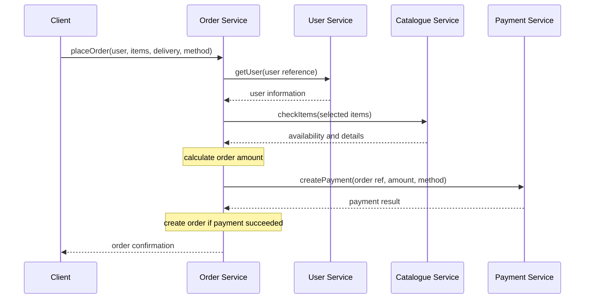
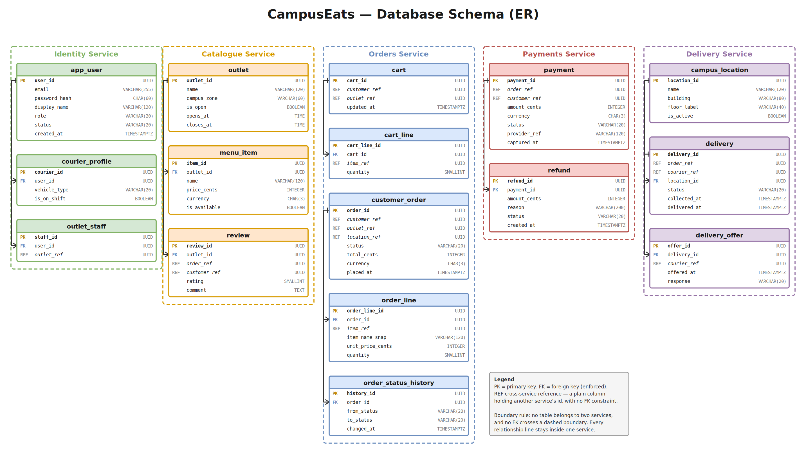

# Assignment 2 — CampusEats Design Benchmark

**CS 543 — Web Services** · `Group 8`

A service-oriented design for **CampusEats**, the campus food-ordering platform described
in [Assignment 1](../Assignment1/brief.md). The assignment works through six tasks: listing
the system's capabilities, cutting them into services, writing contracts for those services,
specifying one operation in depth, sketching the data each service owns, and validating the
result against the five properties of a service.

## Contents

| File | Task | What it is |
| :--- | :--- | :--- |
| [design.pdf](design.pdf) | 1 | Capability list — the 10 distinct jobs the system performs |
| [services.png](services.png) · [services.drawio](services.drawio) | 2 | Service map — boundaries, ownership, and the calls between services |
| [designtask3.pdf](designtask3.pdf) | 3 | Service contracts — operations with inputs, outputs, and errors |
| [designtask4.pdf](designtask4.pdf) | 4 | `placeOrder` specification — flow, hidden internals, error cases |
| [schema.sql](schema.sql) · [schema.png](schema.png) · [schema.drawio](schema.drawio) | 5 | `CREATE TABLE` sketch — one schema per service |
| [designtask6.pdf](designtask6.pdf) | 6 | Service validation — five-property matrix, gaps, and fixes |

---

## Task 1 — Capability List

The capabilities are the distinct jobs the system performs, derived from the verbs in the
Assignment 1 brief.

| # | Capability | What the system does |
| :--- | :--- | :--- |
| 1 | Register | Create a new user account |
| 2 | Login | Authenticate an existing user |
| 3 | View Menu | Display available menus and food items |
| 4 | Search Food | Search for food items |
| 5 | View Food Item | Display details of a selected food item |
| 6 | Place Order | Create an order for selected food items |
| 7 | Update Order | Modify an existing order |
| 8 | Cancel Order | Cancel an existing order |
| 9 | Manage Menu | Create, update, or remove menu information |
| 10 | Manage Food Services | Manage food-service information |

Ten capabilities in total, covering user authentication, catalogue browsing and management,
and order management.

---

## Task 2 — Service Decomposition


| Service | Owner | Owns |
| :--- | :--- | :--- |
| **Identity / User Service** | Priya *(Leader)* | User account, credentials, role, courier profile |
| **Catalogue Service** | Nandan Kabra | Outlet, menu item, menu availability, review |
| **Orders Service** | Neeraj Sharma | Cart, order, order line, order status history |
| **Payments Service** | Abhinav Gupta | Payment, refund, provider reference |
| **Delivery Service** | — | Delivery, delivery offer, campus location |

### Boundary rule

> No two services share data. Every arrow on the map is a call across a boundary, never a
> shared table. Each arrow is labelled with the operation used.

Cross-service calls on the map: `verifyCustomer`, `verifyOutletStaff`, `checkItems`,
`getCustomerBillingRef`, `getCourierProfile`, `requestDelivery`, `reportDeliveryStatus`.

---

## Task 3 — Service Contracts

### User Service — Priya *(Leader)*

Owns: Users, Authentication

| Operation | Input | Output | Errors |
| :--- | :--- | :--- | :--- |
| `register` | name, email, password | Registration confirmation | Email already exists, invalid input |
| `login` | email, password | Authentication result | Invalid credentials, account not found |
| `getUser` | user reference | User information | User not found |

### Catalogue Service — Nandan

Owns: Food Services, Menus, Food Items

| Operation | Input | Output | Errors |
| :--- | :--- | :--- | :--- |
| `viewMenu` | menu request | Available menu items | Menu unavailable |
| `searchFood` | search query | Matching food items | No matching items |
| `getFoodItem` | food item reference | Food item details | Food item not found |
| `checkItems` | selected food items | Item availability and details | Item unavailable, invalid item |
| `manageMenu` | menu reference, menu details, action | Updated menu confirmation | Menu not found, invalid input, not authorised |
| `manageFoodService` | food service reference, service details, action | Updated food service confirmation | Food service not found, invalid input, not authorised |

### Order Service — Neeraj

Owns: Orders, Order Items

| Operation | Input | Output | Errors |
| :--- | :--- | :--- | :--- |
| `placeOrder` | user reference, selected items and quantities, delivery details, payment method | Order confirmation, order details, final amount, payment result | User not found, invalid or unavailable item, invalid quantity, invalid delivery details, payment failed, order not created |
| `updateOrder` | order reference, updated items/details | Updated order confirmation | Order not found, order cannot be updated |
| `cancelOrder` | order reference | Cancellation confirmation | Order not found, order cannot be cancelled |
| `getOrder` | order reference | Order details | Order not found |

### Payment Service — Abhinav

Owns: Payments, Payment Status

| Operation | Input | Output | Errors |
| :--- | :--- | :--- | :--- |
| `createPayment` | order reference, amount, payment method | Payment result | Payment failed, invalid details |
| `checkPaymentStatus` | payment reference | Payment status | Payment not found |

---

## Task 4 — `placeOrder` Specification

`placeOrder` creates a new order for a user from selected food items and quantities. It
coordinates with the User, Catalogue, and Payment services while hiding its internal
implementation from the caller.

### Inputs and outputs

| Inputs | Outputs |
| :--- | :--- |
| User reference | Order confirmation |
| Selected food items | Order details |
| Quantity for each item | Final order amount |
| Delivery details | Payment result |
| Payment method | |

### Operation flow

| Step | Action | Handled by |
| :--- | :--- | :--- |
| 1 | Receive the `placeOrder` request | Order Service |
| 2 | Validate the user | User Service — `getUser` |
| 3 | Check the selected food items | Catalogue Service — `checkItems` |
| 4 | Calculate the order amount | Order Service |
| 5 | Request payment | Payment Service — `createPayment` |
| 6 | Create the order if payment succeeds | Order Service |
| 7 | Return the order confirmation | Order Service |



### Error cases

User not found · invalid food item · food item unavailable · invalid quantity · invalid
delivery details · payment failed · order could not be created.

### Hidden from callers

How the order and its items are stored, how availability is checked, how the final amount
is calculated, how payment processing is implemented, which tables and SQL queries are
used, and how services communicate internally. The caller sees only the `placeOrder`
contract and receives either the defined output or an appropriate error.

---

## Task 5 — Data Schema



[schema.sql](schema.sql) defines one PostgreSQL schema per service. In deployment each
schema would be its own database; they are kept together here so the whole design can be
created and inspected in one place.

| Schema | Tables |
| :--- | :--- |
| `identity` | `app_user`, `courier_profile`, `outlet_staff` |
| `catalogue` | `outlet`, `menu_item`, `review` |
| `orders` | `cart`, `cart_line`, `customer_order`, `order_line`, `order_status_history` |
| `payments` | `payment`, `refund` |
| `delivery` | `campus_location`, `delivery`, `delivery_offer` |

### The `_ref` convention

> A `FOREIGN KEY` only ever points at a table in the **same** schema. Columns ending in
> `_ref` hold an id owned by another service and deliberately carry **no** foreign key
> constraint — that value is resolved by calling the owning service, not by joining to it.

Because `_ref` columns cannot be indexed via a foreign key but are looked up constantly,
the schema declares explicit indexes on them (`idx_customer_order_customer_ref`,
`idx_payment_order_ref`, `idx_delivery_order_ref`, and others).

`orders.order_line` also snapshots `item_name_snap` and `unit_price_cents` at the time of
order, so order history stays correct even if the catalogue item later changes or is
withdrawn.

### Loading the schema

```bash
psql -d campuseats -f schema.sql
```

---

## Task 6 — Service Validation

Each service is checked against the five properties of a service. **Yes** means the
property holds as designed; **Partial** means it holds only under assumptions not yet
guaranteed; **No** means the current design fails it.

| Service | Reachable | Self-contained | Has a contract | Independent | Loosely coupled |
| :--- | :---: | :---: | :---: | :---: | :---: |
| User Service | ✅ Yes | ✅ Yes | ✅ Yes | ✅ Yes | ✅ Yes |
| Catalogue Service | ✅ Yes | ✅ Yes | ✅ Yes | ✅ Yes | ⚠️ Partial |
| Order Service | ✅ Yes | ✅ Yes | ✅ Yes | ❌ No | ⚠️ Partial |
| Payment Service | ⚠️ Partial | ✅ Yes | ✅ Yes | ✅ Yes | ✅ Yes |

### Gaps and fixes

| Service | Property | Why it fails | How we would fix it |
| :--- | :--- | :--- | :--- |
| Order Service | Independent (No) | `placeOrder` calls User, Catalogue, and Payment synchronously. If any one is down, no order can be placed at all, so the service cannot operate on its own. | Create the order in `PENDING` state first and confirm it when the payment result arrives, so an order is never lost after a successful charge. Add timeouts and retries on every outbound call, and fail with a clear error instead of hanging. |
| Order Service | Loosely coupled (Partial) | The order item's food-item reference points at Catalogue rows. If Catalogue deletes an item or reuses an ID, past orders become wrong or unreadable. | Catalogue soft-deletes items (`is_available = FALSE`) and never reuses an ID. Order Service already snapshots item name and unit price, so order history renders correctly even if the item later changes or disappears. |
| Catalogue Service | Loosely coupled (Partial) | `manageMenu` and `manageFoodService` are restricted operations, so the service has to ask User Service to check the caller on every request. | Issue signed tokens from User Service and have Catalogue verify the signature locally with a public key, removing the runtime dependency. |
| Payment Service | Reachable (Partial) | Only Order Service calls it. `checkPaymentStatus` has no route exposed to clients, so a user cannot check a payment they started. | Publish `checkPaymentStatus` through the API gateway on a stable address, with the caller's identity checked against the order that owns the payment. |

**User Service passes all five properties**: it is reachable at a published address, owns
its data end to end, exposes a defined contract, calls no other service, and is referenced
by others only through opaque user identifiers.

---

## Note on Consistency

The service map and `schema.sql` model **five** services — Identity, Catalogue, Orders,
Payments, and Delivery — while the contracts (Task 3) and validation matrix (Task 6) cover
**four**, with Delivery folded into Orders. The Delivery Service therefore has no written
contract and no owner assigned. Worth reconciling before submission: either add a Delivery
contract and validation row, or merge `delivery.*` into the `orders` schema.
