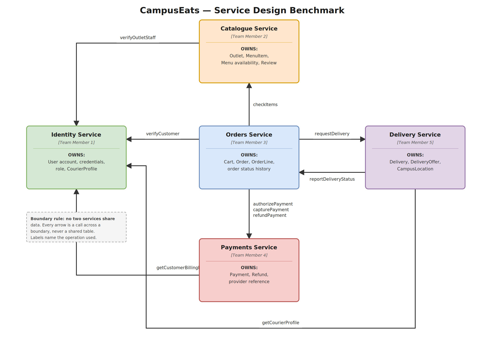

<div align="center">

# 🍽️ CampusEats

### Design Benchmark

**CS 543 — Web Services**

`Group 8`

</div>

---

## Team Members

<!--
  TO ADD A GITHUB USERNAME: replace the placeholder in BOTH the image src and the link
  on that row — e.g. swap every `PRIYA-GITHUB` for `priya123`.
  The avatar is pulled live from https://github.com/<username>.png, so it stays current
  by itself whenever that person changes their profile picture.
-->

| | Name | Roll Number | GitHub | Role | Service Owned |
| :---: | :--- | :--- | :--- | :--- | :--- |
|  | **Priya** | 20251651073 | [@PRIYA-GITHUB](https://github.com/PRIYA-GITHUB) | Leader | User Service |
|  | **Nandan Kabra** | 20251651060 | [@NANDAN-GITHUB](https://github.com/NANDAN-GITHUB) | Member | Catalogue Service |
|  | **Neeraj Sharma** | 20251651063 | [@NEERAJ-GITHUB](https://github.com/NEERAJ-GITHUB) | Member | Order Service |
|  | **Abhinav Gupta** | 20251651002 | [@ABHINAV-GITHUB](https://github.com/ABHINAV-GITHUB) | Member | Payment Service |

> ⚠️ The Assignment 2 service map and schema also define a **Delivery Service**, which has no
> owner, contract, or validation entry yet — see the consistency note in
> [Assignment 2](Assignment2/#note-on-consistency).

---

## About the Project

**CampusEats** is an online food-ordering platform designed for a college campus. It lets
students browse menus from campus cafeterias and nearby restaurants, place orders, pay for
them, and track delivery — while giving vendors and administrators the tools to manage
menus, orders, and users.

The system is decomposed into independent services, each owning its own data and exposing a
defined contract. The full design is in [Assignment 2](Assignment2/).

### Service Map



| Service | Owner | Owns |
| :--- | :--- | :--- |
| **User Service** | Priya | User account, credentials, role, courier profile |
| **Catalogue Service** | Nandan Kabra | Outlet, menu item, menu availability, review |
| **Order Service** | Neeraj Sharma | Cart, order, order line, order status history |
| **Payment Service** | Abhinav Gupta | Payment, refund, provider reference |
| **Delivery Service** | *unassigned* | Delivery, delivery offer, campus location |

> **Boundary rule:** no two services share data. Every arrow on the map is a call across a
> boundary, never a shared table. A foreign key never crosses a service boundary — ids owned
> by another service are held in `_ref` columns and resolved by calling that service.

### Capabilities

| | | |
| :--- | :--- | :--- |
| 1 Register | 2 Login | 3 View Menu |
| 4 Search Food | 5 View Food Item | 6 Place Order |
| 7 Update Order | 8 Cancel Order | 9 Manage Menu |
| 10 Manage Food Services | | |

### Users of the System

- **Students** — browse menus, place orders, pay, and track deliveries
- **Restaurant / Cafeteria Staff** — manage menus, receive orders, update order status
- **Delivery Personnel** — pick up orders and deliver them to students
- **Administrators** — manage users, restaurants, and menus; monitor system activity

---

## Repository Structure

```
lab/
├── README.md               # you are here
├── Assignment1/
│   ├── README.md           # Assignment 1 write-up
│   ├── brief.md            # CampusEats system brief (nouns & verbs)
│   ├── http-log.md         # raw curl -i request/response transcripts
│   ├── network-analysis.md # DevTools network profile
│   └── campuseats-api/
│       └── db.json         # mock REST API seed data
└── Assignment2/
    ├── README.md           # Assignment 2 write-up
    ├── design.pdf          # task 1 — capability list
    ├── services.drawio     # task 2 — service map (+ services.png)
    ├── designtask3.pdf     # task 3 — service contracts
    ├── designtask4.pdf     # task 4 — placeOrder specification
    ├── schema.sql          # task 5 — CREATE TABLE sketch (+ schema.drawio/.png)
    └── designtask6.pdf     # task 6 — service validation
```

## Assignments

| # | Assignment | Description |
| :--- | :--- | :--- |
| 1 | [Assignment 1](Assignment1/) | System brief, mock REST API with `json-server`, HTTP request logging, and browser network analysis |
| 2 | [Assignment 2](Assignment2/) | Design benchmark — capability list, service decomposition, service contracts, `placeOrder` specification, per-service schema, and service validation |

## Tools Used

`curl` · `json-server` · Chrome DevTools Network panel · draw.io · PostgreSQL

---

## Contributors

<!--
  This block updates ITSELF — no editing required. Once a collaborator accepts their
  invitation and pushes at least one commit, their avatar appears here automatically.
-->

<a href="https://github.com/nandankabra/campuseats-/graphs/contributors">
  
</a>

### Adding a collaborator

1. On GitHub, open the repository → **Settings** → **Collaborators** → **Add people**
2. Enter their GitHub username or the email on their GitHub account
3. They accept the invitation from their email or from https://github.com/notifications
4. After their first commit they appear in the contributors graph above, and in
   **Insights → Contributors**

Add their username to the [Team Members](#team-members) table at the same time — that table
is written by hand and does not fill itself in.

---

<div align="center">

Indian Institute of Information Technology, Vadodara · Semester 3

</div>
